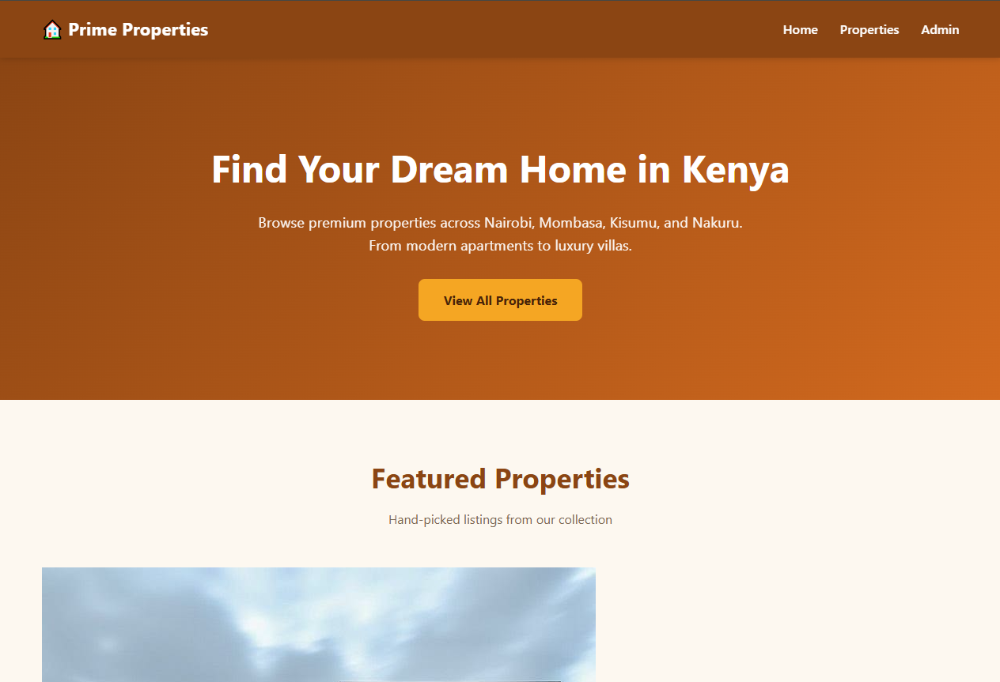
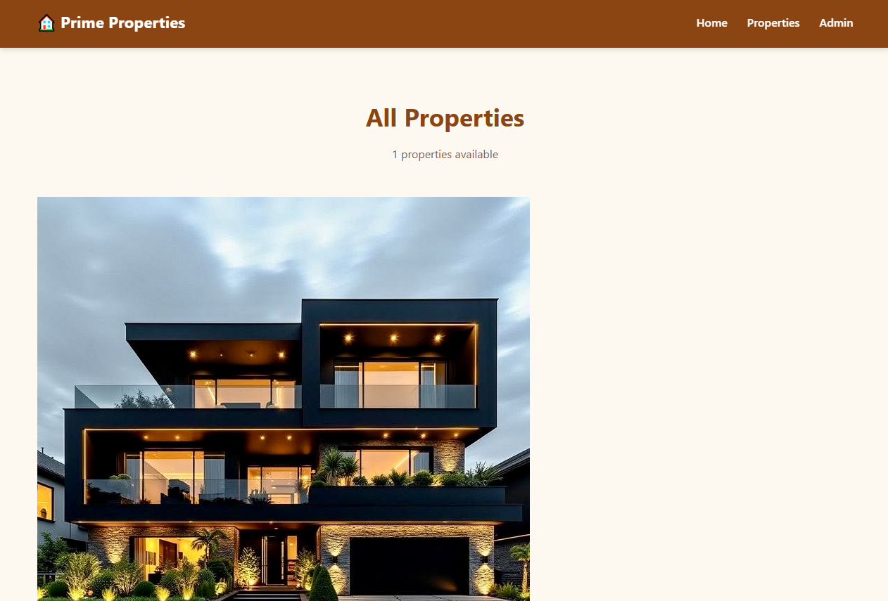
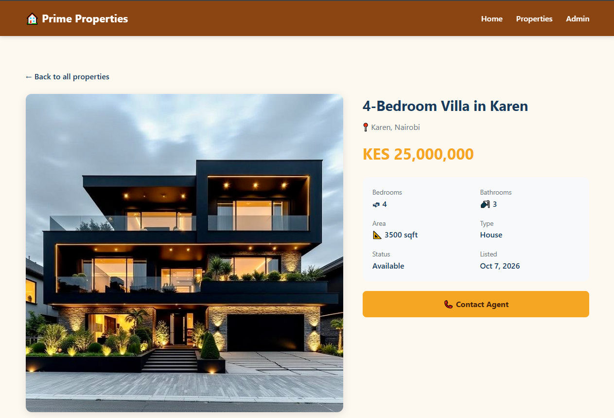

# 🏠 Real Estate Website

A real estate listing website built with Django and Python.

## Features

- Property listings with photos, prices, and details
- Featured properties on the homepage
- Browse all properties
- Individual property detail pages
- Admin panel to manage listings
- Mobile-friendly responsive design

## Tech Stack

- Python 3.12
- Django 6.1
- SQLite
- HTML/CSS

## Screenshots

### Homepage


### Properties


### Property Detail


## Setup

```bash
git clone https://github.com/sammshawn/realestate-django.git
cd realestate-django
python -m venv venv
venv\Scripts\activate
pip install django Pillow
python manage.py migrate
python manage.py createsuperuser
python manage.py runserver